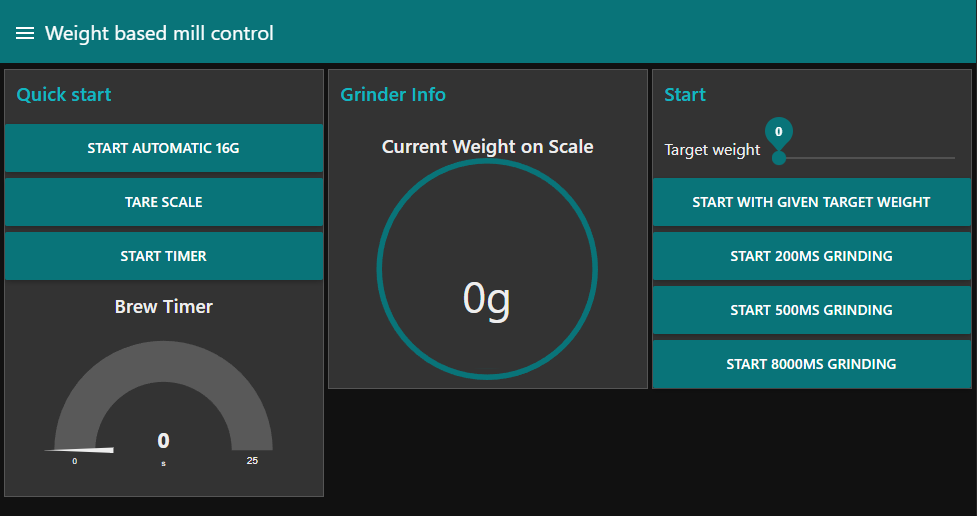

I enjoy a good cup of coffee. To achieve that at home, I bought a coffee grinder along with a nice espresso machine. Several factors are important for a great-tasting coffee: coarseness, dosage, quality of the beans, extraction time, and more. To find the best-tasting coffee, it is crucial to minimize the changing factors, one of which is the amount of beans. Previously, I had to stand by the coffee grinder with a scale and manually measure the amount of ground beans. After working from home for a while, I got annoyed with this process, so I decided to automate the grinding of the beans.

Having gained some experience in the `ESP8266` world, I decided to use a `D1-mini` for the task. After some research, I chose to use a load cell along with the load cell amplifier HX711. The grinder itself is switched on and off by a relay controlled by the `D1-mini`.

A `node-red` flow along with the `node-red`-dashboard is used to control the `D1-mini`. The commands are sent through `mqtt` topics.

On the dashboard, there are several functions: weight-based and time-based grinding, a brew timer, and the taring of the scale. The main challenge with this project was that it takes some time for the ground coffee to reach the scale while grinding. Therefore, stopping the grinder when the weight is reached might already be too late. It was necessary to stop the grinding process a bit earlier and then grind some more until the target weight is reached.

::github{repo="Jerey/coffee-automation"}
