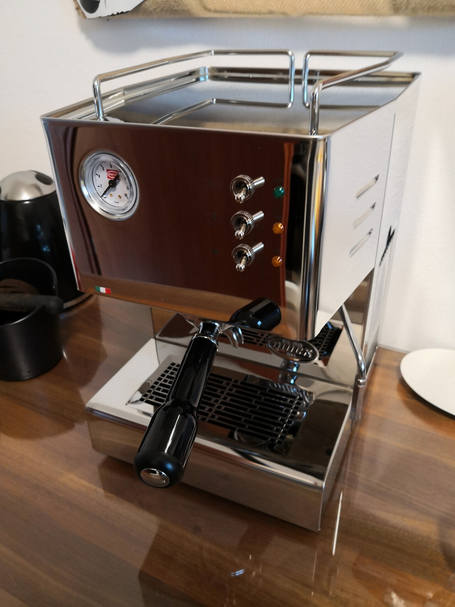
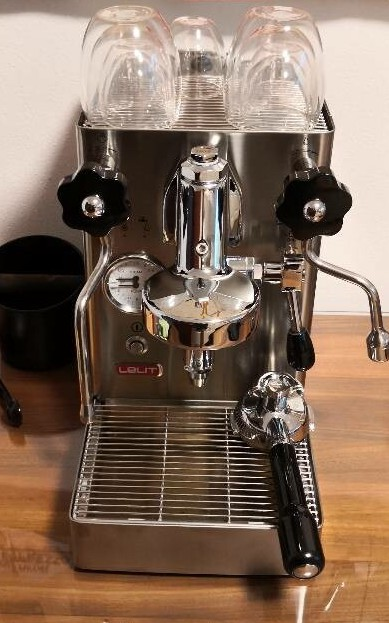

It might be obvious from some of my projects, but I love coffee.
In 2018, I started with a cheap espresso maker. It broke rather quickly, but in doing so, it sparked my deep interest in coffee.

## Getting Started with Espresso

There are countless guides on what makes a good espresso. Factors like grind coarseness, coffee dosage, bean selection, and grinder quality all play a role (always grind fresh!). Then, there are standard guidelines:

- Espresso should take around **25 seconds** from the first drop to the last.
- The typical ratio is around **1:2.5**—meaning if you use **15g of coffee beans**, you aim for **37.5g of espresso** in your cup.

But the most important rule? These are just starting points. The real goal is always **taste** — the most important part is that the espresso tastes the way you want it and that you enjoy the process of making it.

## Why an Espresso Maker?

One question I hear a lot from guests is: *“Why an espresso maker? Doesn’t the whole process feel tedious?”*

Well, yes and no.

A fully automated machine simplifies life, but that also means you end up drinking more coffee just because it’s so convenient. There’s also the cleaning aspect — manual espresso machines with portafilters allow for thorough cleaning, whereas most automatic machines provide little access to their internal brewing components.

And then, of course, there’s the **taste**. I’ve yet to find an automatic espresso machine that matches the flavor of a well-dialed-in manual espresso shot. Why shouldn’t your home-brewed espresso taste just as good as the one from your favorite coffee shop?

## Quickmill Cassiopea

After my first espresso maker broke, I bought the **Quickmill Cassiopea**. This machine features dedicated thermoblocks for both coffee extraction and hot water/steam, allowing simultaneous espresso pulling and milk frothing.

The good part about the coffee machine was the quick heat-up time thanks to the thermoblocks. The bad parts were the weak steam power and that the group head is Quickmill-specific, limiting the accessories available for it.

## E61 Group Head

After a few years, I wanted to try an **E61 group head**. I sold my Quickmill at a small loss and started looking for a new machine. After some research, it came down to two machines.

### Lelit Mara X vs. Bezzera Magica S

Both machines use the **E61 group head**, meaning a wide variety of accessories are available. Apart from aesthetics, the key difference was that the **Mara X** offers temperature control settings and different brewing modes:

- **Steam Priority Mode** – Functions like a traditional E61 machine.
- **Coffee Priority Mode** – A Lelit-specific setting that optimizes for espresso extraction.

> [!NOTE]
> The modes have evolved over time — if you buy a Mara X today, it may have different options.

In the end, the **Mara X simply made better-tasting espresso** in my testing, so I went with it. Since September 2020, I’ve been very happy with my choice.

### The Big Drawback: Heat-Up Time

A common downside of **E61 machines** is their long **heat-up time**. Lelit states **24 minutes**, but real-world measurements show that stability is achieved **after 30 minutes**. And temperature stability is critical for consistent shots.

My solution? A **WiFi smart plug** that preheats the machine automatically. While this helps, it doesn’t allow for spontaneous espresso-making. Plus, **E61 machines consume a lot of energy** compared to thermoblock machines since they heat an entire boiler just to extract a few milliliters of espresso.

## Final Thoughts

Like many hobbies, espresso making can become a deep rabbit hole. There’s an overwhelming amount of information online, sometimes to the point, where you optimize settings, despite liking the taste already.

Would I buy my setup again? **Probably not.**

Since purchasing the Mara X, new machines have emerged. While I appreciate the E61 experience, I dislike the long heat-up times and high energy consumption. Yes, the smart plug is a decent workaround, but spontaneous espresso isn’t really an option.

