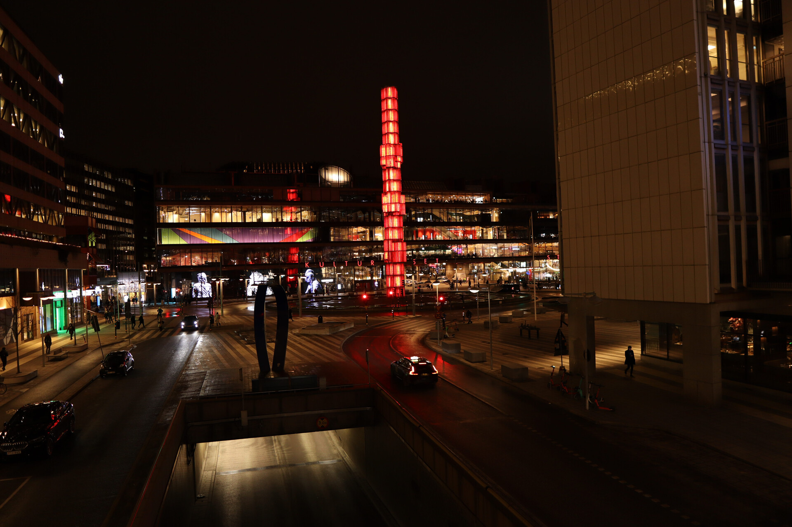

# Stockholm, Kiruna and Oslo

As I embarked on this journey through Scandinavia, my passion for photography grew alongside my excitement to capture the breathtaking beauty of these cities and landscapes. From the Northern Lights in Kiruna to the stunning architecture of Stockholm and Oslo, each destination offered a unique experience that pushed my skills to new heights.

## Stockholm

Our journey began in Stockholm, a great city to get started with photography. The city's rich culture, delicious food, and shorter winter days made it an ideal spot to test my camera. We spent three nights exploring the city's many museums, including the Vasa Museum on the island of Djurgården.

### Vasa Museum

The Vasa Museum is home to a Swedish warship that sank on its maiden voyage in the 17th century. The ship was discovered in the 1950s and has undergone extensive preservation efforts. I had previously visited this museum several times, but it never failed to amaze me.
Having bought the Canon EOS M50 Mark II and the Sigma EF-M 16mm f/1.4 prior to this trip, I had to bring it to the museum. That allowed me to further figure out photography in dark conditions.

### Julbord

Despite growing up in Austria, my family always celebrated Christmas in a Swedish fashion - so with a traditional Swedish Christmas feast, known as Julbord.
During December, several restaurants offer a Julbord.
So additionally to Christmas, I got to enjoy this buffet an additional time that year.

### Walking

The best way to explore a city is typically by walking. This allowed us to take photos whenever we stumbled across nice places. My friend taught me a few tricks on photography. For example in the following photo if you look to the left of the light pole, you can see a large tower far away in the background.
This tower drew attention to it, which was not the intention for this photo. So by strategically placing the light pole in front of it, the photo became visually more appealing.

In addition to exploring the city, we also tried some delicious Swedish street food, like Tunnbrödsrulle, a flatbread wrapped around a sausage, mashed potatoes, and other tasty fillings.

Here are a few impressions of Stockholm and some of my first photos with my camera.

## Kiruna

After three days in Stockholm, we flew to Kiruna. I definitely recommend a seat at the window, as the landscape is spectacular.
We had a rental car in Kiruna, which introduced a first time: Driving a car with spikes.
Similar to Stockholm, we immediately started walking around the city, grabbed a Souvas Rulle (similar to the Tunnbrödsrulle, but with reindeer meat instead of the sausage) and spent some time in the apartment waiting for the Northern Lights.

As I wrote in the last post, we checked out the local church, walked around the town in the dark and drove to a less light polluted area to raise the chances of seeing the Northern Lights - which we kind of did, but only through the lens of the camera.

We also took part in an Aurora expedition with dinner - a snowmobile, Northern Lights and dinner tour. Sadly we did not see the Northern Lights that day, but the landscape and food were great.
Another day, we drove to the Esrange Space Center. It was a long car drive, but it was worth it. We stopped on several occasions for photography and even saw a Moose and a Reindeer in the wild. The space station visitor center was interesting, but the best part about going there was definitely the landscape and the almost untouched nature.

After that, we went on to our next hotel, which was situated at the Torne river. There we were able to see the Northern Lights with our eyes.

## Oslo

To finish our Scandinavian trip - sorry Finland - we went to Oslo in Norway. We walked through the city, took several photos at the Oslo Opera House and the pier. We saw the Royal Palace and took it rather slow and easy that day, after having spent much time sightseeing and taking photos.

## Final Thoughts

The entire trip was a great experience. The Northern Lights were definitely the highlight of this journey. Kiruna is an awesome city and I definitely want to go there again. I have been to Stockholm often, so it is kind of "known" but as always a great experience. And Oslo has been awesom. It was nice to see the city for a second time, but due to the Corona pandemic rising again, many activities were not possible and we were also already exhausted from the past days walking and taking pictures.
