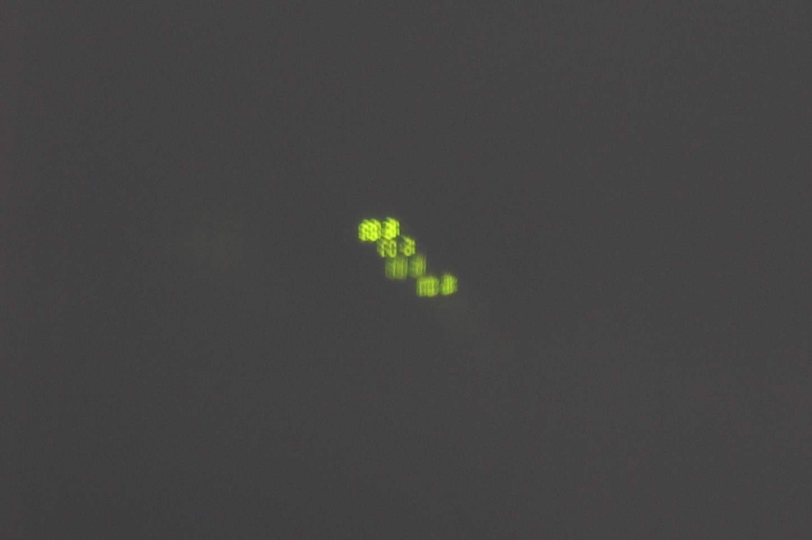
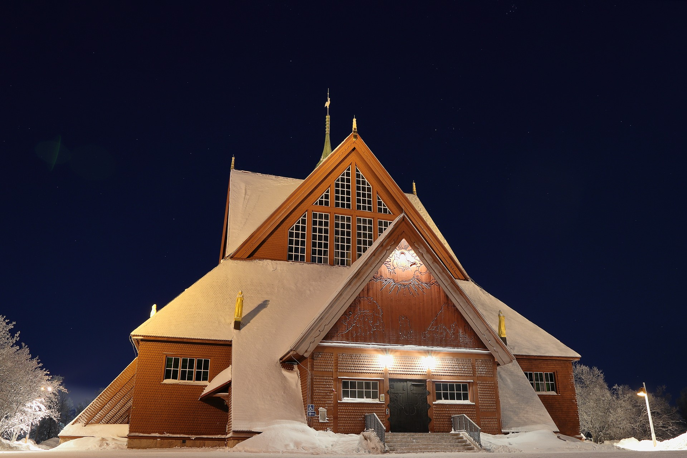
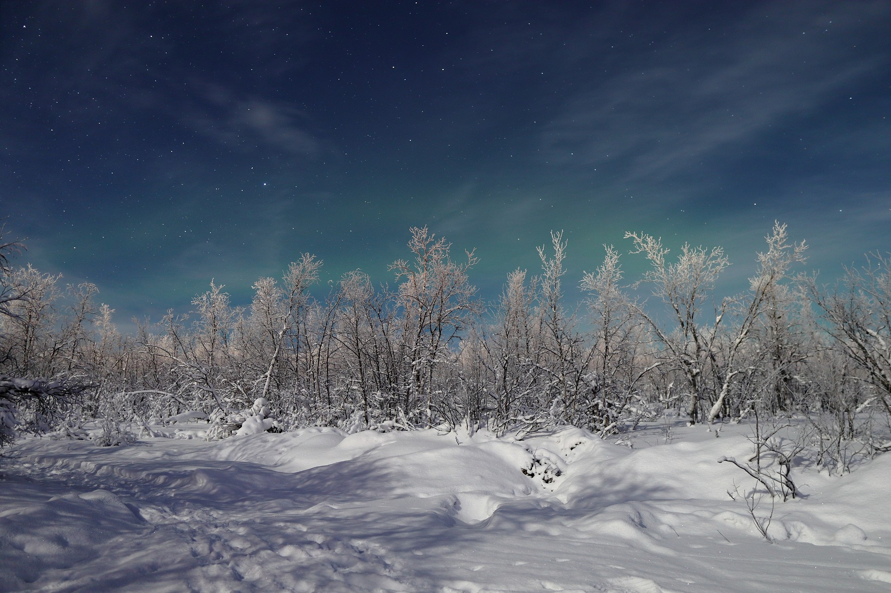
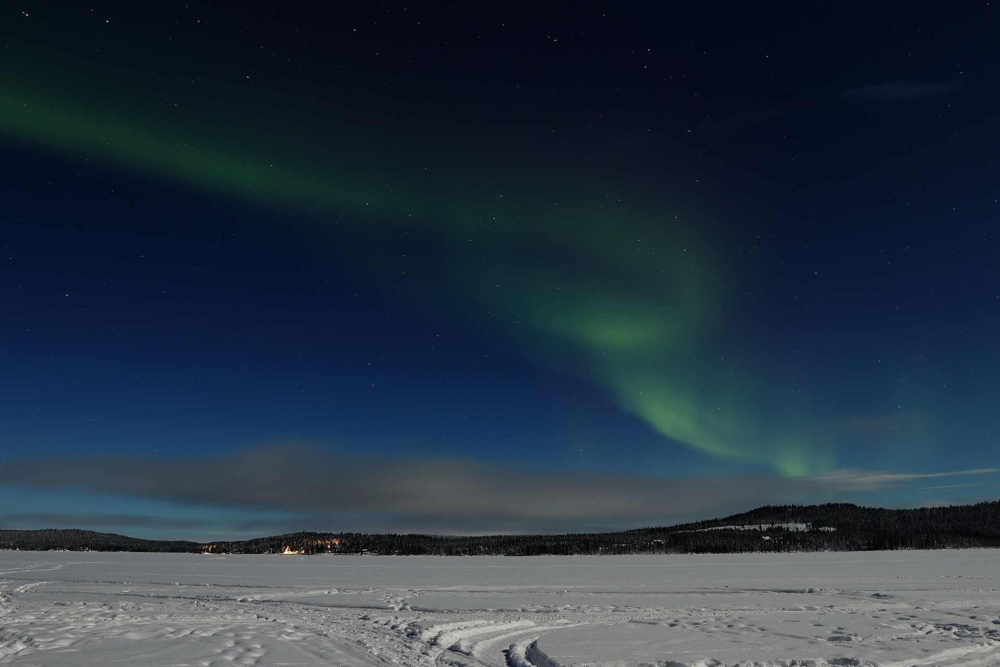
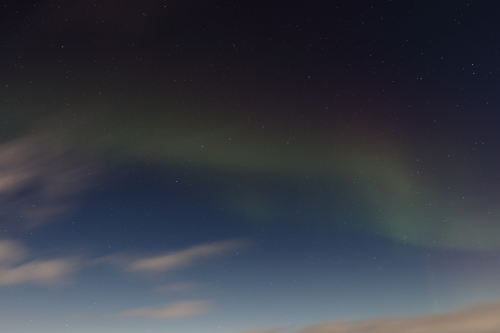
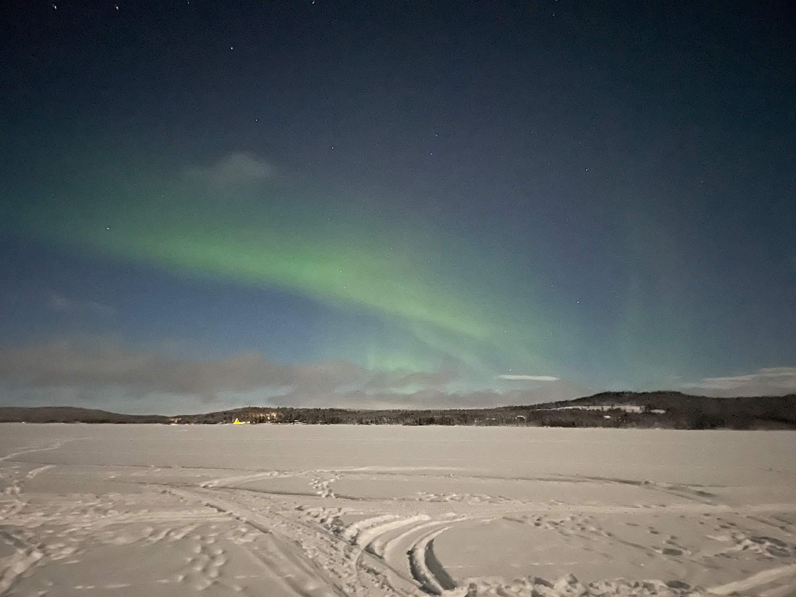

# Introduction

Having Swedish roots, a friend of mine asked me in 2021, if I wanted to join him on a trip to Sweden to capture the Northern Lights.

## Camera Setup

Up until then, I had primarily taken photos with my phone. In 2015, I started creating yearly photo albums after realizing that I rarely revisited my pictures. This practice motivated me to take more photos, knowing they would be part of my next album. As a result, I had already been considering purchasing an entry-level mirrorless camera. The chance to photograph the Northern Lights became the final push I needed. I bought an used Canon EOS M50 Mark II, which came with a Canon EF-M 15-45mm f/3.5-6.3 IS STM lens.

## Lenses and a Tripod

My friend, an experienced photographer, quickly introduced me to essential photography techniques and settings. He recommended purchasing an additional lens for capturing the Aurora Borealis: the SIGMA EF-M 16mm f/1.4. Its wide aperture would allow more light to enter, making it ideal for low-light photography.

Another lens he suggested was the Canon EF 50mm f/1.8, perfect for portrait photography. Since my M50 has an EF-M mount, I needed an adapter to use this lens. This exposed one of the first drawbacks of my camera: the limited availability and high cost of compatible lenses.

Another crucial investment was a sturdy tripod. I chose the Rollei Compact Traveller No. 1, ensuring stability for long-exposure shots.

## Kiruna

With my camera gear ready, I began testing my lenses and exploring the camera’s settings. Initially, it was overwhelming, but much of my learning came from hands-on experimentation during the trip.

December in Kiruna is incredibly cold, so we often found ourselves indoors, waiting for the Northern Lights or preparing food. During these breaks, we experimented with different camera settings, even attempting to take photos through the windows. One amusing moment occurred when I excitedly captured a green light on my camera, only to realize upon closer inspection that it was the reflection of the microwave clock. The long exposure time had allowed the camera to pick up details that were invisible to the naked eye.

We ventured into the city and its surroundings. After capturing several shots of the local church, we drove to a remote area with minimal light pollution. At first, we saw what appeared to be an unusual cloud, but upon pointing the camera at it, we discovered that it was actually the Aurora Borealis. While it wasn’t yet visible to the naked eye, seeing it through the camera was thrilling.

Our next hotel was situated near the river Torne surrounded by a forest — an ideal location for photography but also a gamble, as the northern lights are not guaranteed and there was not much else to do there. Fortunately, luck was on our side. This time, we could see the lights with our bare eyes — not as vividly as through the camera, but still an unforgettable sight.

Here a photo for comparison taken with my phone:

## Final Thoughts

All in all, the trip to Sweden was an incredible experience. I captured my first stunning photos with a proper camera and compared them to those taken with my phone. However, I also encountered another challenge: post-processing. Editing the images required time and effort — yet another skill to master.

Despite this, the journey reinforced my passion for photography, and I left Sweden with unforgettable memories and a deeper appreciation for the art of capturing light.

