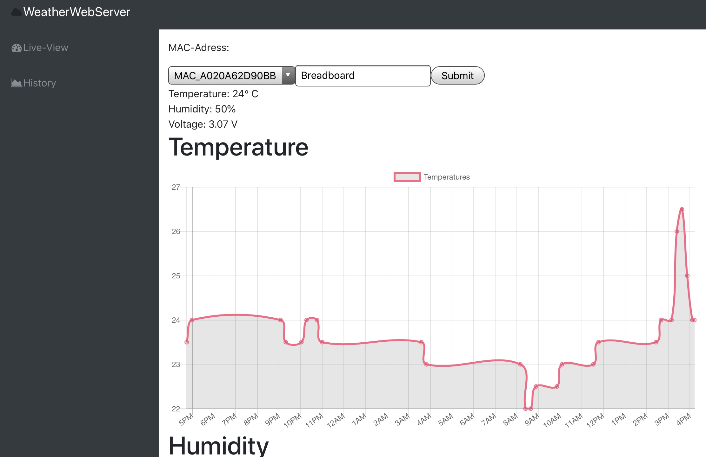
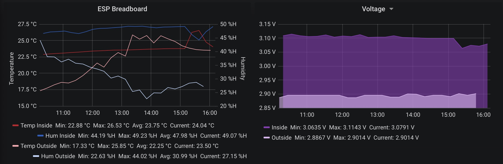

Looking for a project to work on in my spare time that touches on several technologies, I came across the `ESP8266` and had the idea to create a "weather station." It should be able to track the room climate by storing the current temperature and humidity. Additionally, this collected data should be presented in a nice way.

The project consists of two major parts: [The client](https://github.com/jerey/weatherstation-client), which measures the current temperature and humidity and publishes the data via `MQTT`. It is based on an `ESP`, and a custom PCB was created for the `D1 mini` to facilitate the connections. The second part is the server, which stores the received values and presents them in a nice way. There are multiple ways to start a server to handle the data: either with a [Node.js-based server](https://github.com/jerey/weatherstation-server), which was specifically created for this project utilizing a SQL database to store the values and starting a web server to present the data in the form of graphs, or with the help of `node-red`, `influxdb`, and `grafana`. Here, a `node-red` flow is started, which automatically stores the published data to an `InfluxDB`, and `Grafana` is used to visualize it.

::github{repo="Jerey/weatherstation-client"}

::github{repo="Jerey/weatherstation-server"}
